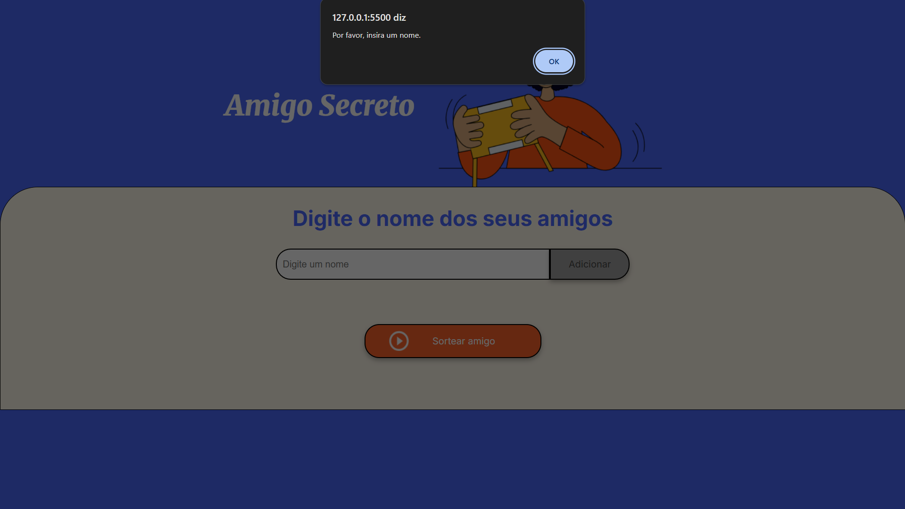
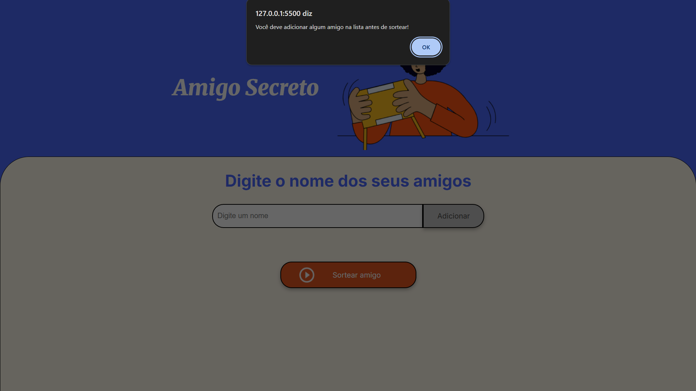
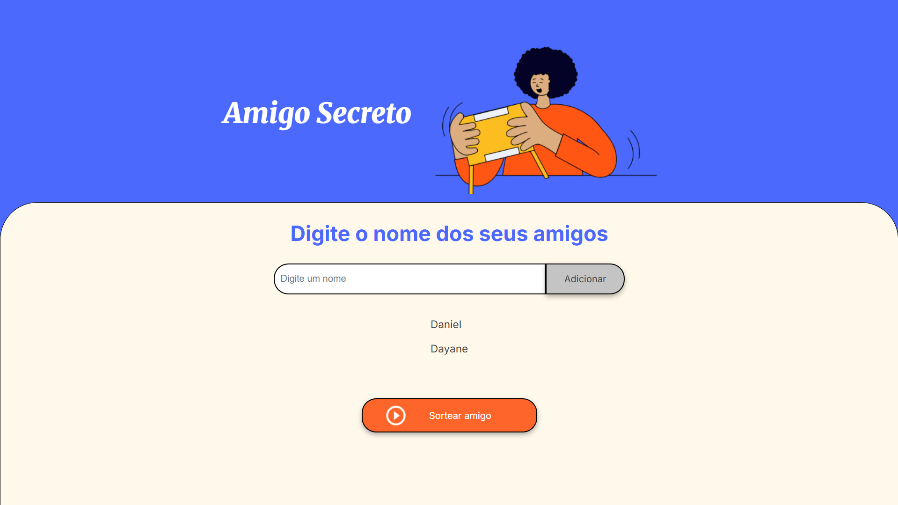
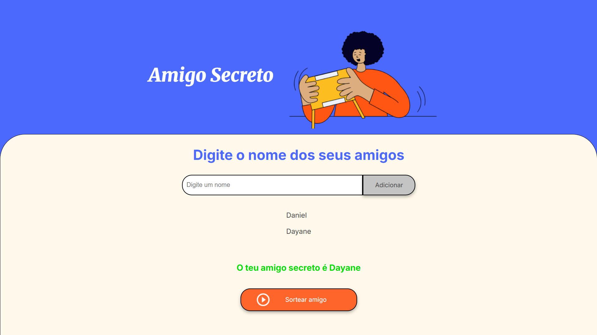
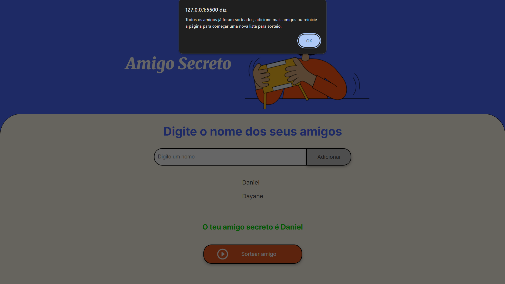

Este projeto simples tem a finalidade de registrar uma lista de amigos para um amigo secreto, em apenas alguns pequenos passos é possível criar a lista e já sortear cada um.

<h1 align="center">Como utilizar:</h1>

-Acesse a aplicação clicando <a href="https://zedaniel06.github.io/challengeAmigoSecreto/">aqui.</a> 
- Insira um nome e então clique em "Adicionar"; 
-Quando já tiver adicionado todos os participantes você pode clicar em "Sortear Amigo"; 

<h1 align="center">Sobre a Validação:</h1>

Se você tentar clicar em "Adicionar" sem ter escrito nada no campo, o seguinte aviso será exibido:

Ao tentar sortear sem inserir nenhum amigo na lista, receberá este aviso:

Uma lista com os amigos já registrados será exibida logo abaixo do campo de texto, após ter pelo menos um item

Você obterá um amigo sorteado a cada clique, sem repetições

Quando todos forem sorteados, ao tentar sortear novamente você receberá a seguinte notificação

<h1>Autor</h1>
 José Daniel Silva de Araújo(https://github.com/ZeDaniel06)
